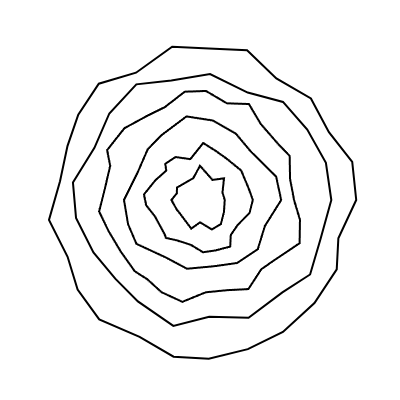

#### Respuesta
- Como se ve el patrón que hace el código:



- El código del patrón:
```
function setup() {
  createCanvas(400, 400);
  noFill();
  stroke(0);
  strokeWeight(2);
  background(255);
  
  // Parámetros de los patrones
  let centerX = width / 2;
  let centerY = height / 2;
  let maxRadius = 150;
  let numShapes = 6;

  for (let i = 0; i < numShapes; i++) {
    let numPoints = int(random(10, 30));
    let radius = maxRadius * (i + 1) / numShapes; 

    beginShape();
    for (let j = 0; j < numPoints; j++) {
      let angle = map(j, 0, numPoints, 0, TWO_PI); 
      let offsetX = random(-10, 10);  
      let offsetY = random(-10, 10);

      let x = centerX + (radius + offsetX) * cos(angle);
      let y = centerY + (radius + offsetY) * sin(angle);
      
      vertex(x, y);
    }
    endShape(CLOSE);
  }
}
```

- Funciones:
  - random(): lo utilicé para determinar el número de puntos en cada patrón (random(10, 30)) y para aplicar un pequeño desplazamiento aleatorio a las posiciones de los puntos (random(-10, 10)), lo que hace que los patrones sean más impredecibles y orgánicos.
  - sin() y cos(): se usan en conjunto con el ángulo calculado a partir de map() para distribuir los puntos alrededor del centro del lienzo, creando patrones circulares.
  - map(): es para convertir el índice de cada punto (j) en un ángulo de 0 a TWO_PI (un círculo completo), asegurando que los puntos estén distribuidos de manera uniforme en cada patrón.
  - beginShape() y endShape(CLOSE): se usan para trazar los patrones generados al conectar los puntos calculados por las funciones sin() y cos().
 
- Modificaciones:
  - Número de puntos: Utilicé random(10, 30) para decidir cuántos puntos tendrá cada patrón. Al hacer esto aleatorio, los patrones varían en complejidad y forma.
  - Radio de cada patrón: El radio de cada patrón aumenta en función de la iteración dentro del bucle, lo que crea patrones concéntricos de diferentes tamaños. Se ajusta con la fórmula radius = maxRadius * (i + 1) / numShapes.
  - Desplazamiento aleatorio: Para darle un toque más caótico y menos simétrico, se añadió un pequeño desplazamiento aleatorio en las posiciones de los puntos con random(-10, 10) en los ejes X y Y.
